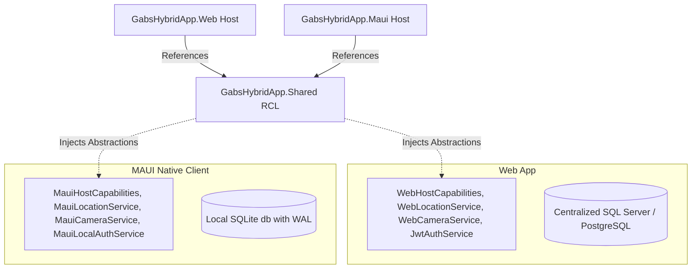

# GabsBlazorHybridApp 🌐📱

[](https://dotnet.microsoft.com/)
[](https://learn.microsoft.com/en-us/aspnet/core/blazor/)
[](https://mudblazor.com/)
[](https://www.docker.com/)

A modern, high-performance, cross-platform Blazor Hybrid application built on **.NET 10.0**. It showcases maximum code reuse by sharing UI layouts, pages, models, and services between a web application and a native mobile/desktop application (.NET MAUI) while preserving native hardware integrations and offline capabilities.

---

## 🛠️ Architecture Overview

The codebase is organized as a clean, modular multi-project solution structure:



### Projects in the Solution
1. **[`GabsHybridApp.Shared`](file:///GabsHybridApp/GabsHybridApp.Shared)** (Razor Class Library)
   - Targets `net10.0` and can run on both browser environments and native applications.
   - Contains all the core Razor Components, Pages (Home, Auth, Counter, Products, Weather, and Device Features), Models (`Product`, `Notification`, `UserAccount`), and generic services.
   - Powered by **MudBlazor** and **CodeBeam.MudBlazor.Extensions** for state-of-the-art UI elements.
   - Employs **Blazor-State** (Flux-like pattern) and **Blazored.LocalStorage** for persistent client state management.
2. **[`GabsHybridApp.Web`](file:///GabsHybridApp/GabsHybridApp.Web)** (ASP.NET Core Web Host)
   - Hosts the interactive server application using Razor components.
   - Exposes web API endpoints (Authentication token exchange & Database synchronization).
   - Configured with a centralized database factory (supports SQL Server, PostgreSQL, or local Web SQLite db).
3. **[`GabsHybridApp.Maui`](file:///GabsHybridApp/GabsHybridApp.Maui)** (.NET MAUI Client Host)
   - Cross-platform native application hosting a Blazor WebView.
   - Targets iOS, Android, macOS (MacCatalyst), and Windows (WinUI).
   - Configured with an offline-first local SQLite database (`hybrid_mauiDb.db`) using EF Core, with Write-Ahead Logging (WAL) enabled for performance and concurrency.

---

## ✨ Core Features & Technical Highlights

### ⚡ Blazor Hybrid Code Sharing
Over 90% of the user interface code and application logic resides in the **Shared** project. Pages automatically adapt based on where the app is running using `IFormFactor` and `IHostCapabilities` abstractions.

### 📶 Host-Agnostic Device Service Architecture
To interact with device hardware safely, the Shared project declares interface abstractions. The hosting applications register the appropriate platform-specific implementations:

| Service | Web App Implementation | MAUI Client Implementation |
| :--- | :--- | :--- |
| **`ILocationService`** | Browser Geolocation API | Native Geolocation API (`Microsoft.Maui.Devices.Sensors.Geolocation`) |
| **`ICameraService`** | HTML5 Camera Stream Capture | MAUI Community Toolkit Camera View API |
| **`IFlashlightService`**| No-op (Flashlight unsupported) | Native Device Flashlight API (`Microsoft.Maui.Devices.Flashlight`) |
| **`INetworkService`** | No-op (Browser fallback) | Native Connectivity API (`Microsoft.Maui.Devices.Connectivity`) |

### 🔒 Secure HMAC Token Exchange Protocol
To prevent leaking master API secrets or long-lived JWT tokens on mobile devices:
1. **Salt Retrieval**: The mobile client fetches a user-specific server-side random salt (`/api/auth/serversalt`).
2. **Key Derivation**: Both server and client derive a unique user-device key using `HMAC-SHA256` with `AppMasterSecret` + `username` + `deviceId` + `serverSalt`.
3. **Short-Lived Assertion**: The client signs a 1-minute JWT assertion containing username, device ID, and a nonce using the derived key.
4. **Token Exchange**: The backend verifies this assertion using the derived key, consumes the nonce (preventing replay attacks), and issues a standard 8-hour synchronization JWT token.

### 🔄 SQLite Synchronization Service
The mobile application uses the custom `ProductSyncService` to seamlessly download and update local products to the offline SQLite database when network connectivity is available, implementing retry behaviors and conflict swallow mechanisms.

---

## 🚀 Getting Started

### Prerequisites
- **.NET 10.0 SDK** (with MAUI workloads installed)
- **Docker & Docker Compose** (for web deployment)
- **SQL Server / PostgreSQL / SQLite** instance

### 🔑 Local Environment Configuration
Create a `.env` file in the root directory to store database connection configurations. Example:

```ini
# Runtime Environment
ASPNETCORE_ENVIRONMENT=Development

# Connection String for the Web Database (SQL Server Example)
CONNECTION_STRING=Server=127.0.0.1,1433;Database=GabsDb;User ID=sa;Password=YourPassword123;Encrypt=True;TrustServerCertificate=True;
```

### 🐳 Running via Docker Compose
Build and run the web backend container targeting Apple Silicon or Linux platforms:

```bash
# Build the container images without using cache
docker compose build --no-cache

# Run the services in the background (detached mode)
docker compose up -d
```

### 🏃 Running Locally from command line
To run the web project:
```bash
dotnet run --project GabsHybridApp/GabsHybridApp.Web/GabsHybridApp.Web.csproj
```

To build and run the MAUI project (Windows example):
```bash
dotnet build GabsHybridApp/GabsHybridApp.Maui/GabsHybridApp.Maui.csproj -t:Run -f net10.0-windows10.0.19041.0
```

---

## 🌁 Developer Tools & Utilities

### ☁️ Cloudflare Secure TCP Tunneling
The repository includes a helper script [`cloudflared-tcp.bat`](file:///cloudflared-tcp.bat) to quickly establish secure tunnels for private services (like development databases) behind Cloudflare Access.
- Run `cloudflared-tcp.bat` in a terminal.
- Follow instructions to install `cloudflared` executable via Chocolatey or skip if already installed.
- Supply the target hostname and local port listener to securely forward database traffic to your local development environment.